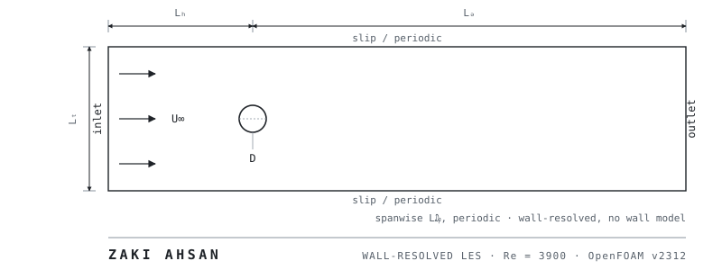
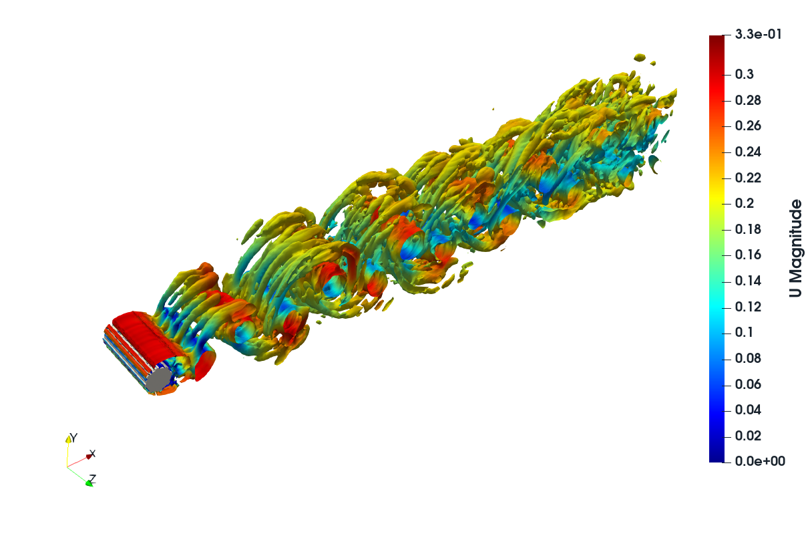
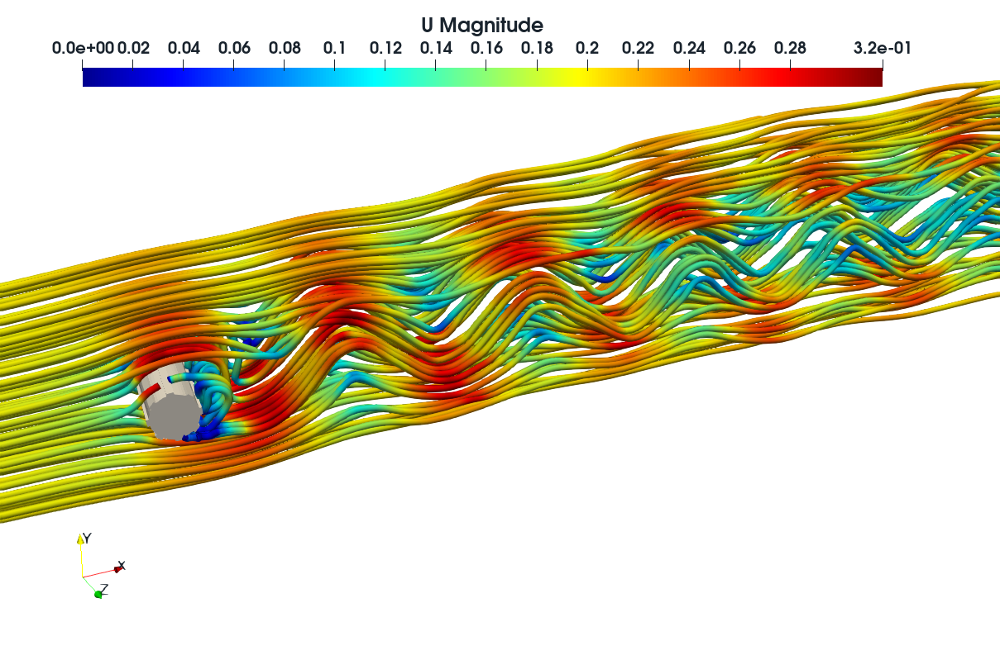
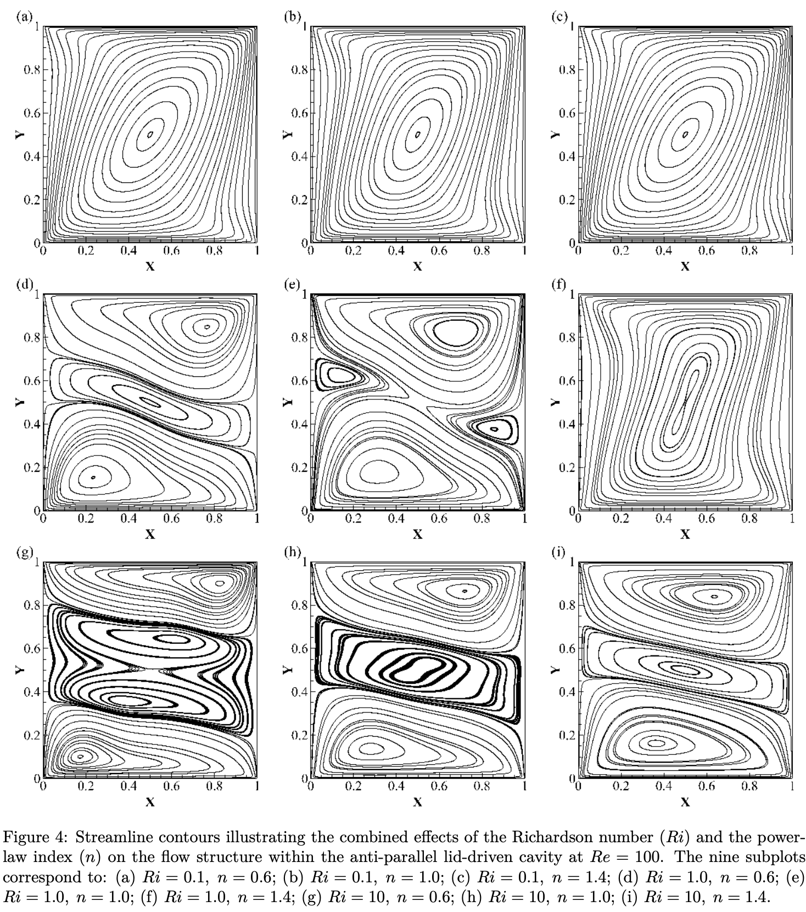

<!--
  DESIGN NOTE — READ BEFORE EDITING.
  The absence of badges, GIFs, streak cards, view counters, trophy widgets and
  logo grids on this page is a deliberate design decision, not an omission.
  The intended reader is a turbulence/CFD faculty member evaluating whether to
  fund a PhD student. For that reader, decoration reduces credibility and
  evidence increases it. Every image on this page is a research artifact.
  If you are tempted to add a shields.io badge, re-read this comment.

  Every value marked [PENDING] must be replaced with a converged, verified
  number from your own run. Do not fabricate a single entry in the validation
  table. A reviewer in this field knows these values from memory and will check.
-->

  

**Wall-resolved large-eddy simulation of separated and turbulent wake flows.**
M.Sc. Applied Mathematics and Computational Science, North South University · Research Assistant, Center for Applied and Computational Sciences · Applying for a funded PhD in Mechanical / Aerospace Engineering, **Fall 2027**.

[Email](mailto:zaakiahsan@gmail.com) · [Google Scholar](<<SCHOLAR URL — create once first preprint is indexed>>) · [ORCID](<<ORCID URL — register today, takes five minutes>>) · [ResearchGate](https://www.researchgate.net/profile/Zaki-Ahsan) · [LinkedIn](<<LINKEDIN URL>>) · [CV (PDF)](<<LINK TO CV IN A PUBLIC REPO>>)

---

I run wall-resolved LES of bluff-body wakes in the subcritical regime, with a current focus on the separated shear layers and vortex formation region behind a circular cylinder at Re = 3900 in OpenFOAM. My secondary line of work is non-Newtonian internal flow — shear-thinning and shear-thickening power-law fluids in driven-cavity geometries, solved in COMSOL.

---

## Flow over a circular cylinder at Re = 3900 — wall-resolved LES

Subcritical regime. No wall model. The objective is to reproduce the canonical statistics to within published experimental scatter, then use the resolved field to examine the vortex formation region and shear-layer transition.

  
   
  Iso-surface of Q = <<VALUE>> U&#8734;&#178;/D&#178;, coloured by streamwise velocity. <<N>> shedding cycles after transient decay.

### Validation against canonical references

> [!NOTE]
> This simulation is ongoing. Cells marked `[PENDING]` are not yet converged and are deliberately left empty rather than estimated.

| Quantity | Present LES | Kravchenko & Moin (2000) | Parnaudeau et al. (2008) | Lourenco & Shih (1993) | Deviation |
|---|---|---|---|---|---|
| Mean drag, C̄d | `[PENDING]` | 0.99 ± 0.05 | — | 0.99 ± 0.05 | `[PENDING]` |
| Strouhal number, St | `[PENDING]` | 0.21 | 0.208 | — | `[PENDING]` |
| Base pressure, −Cpb | `[PENDING]` | 0.94 | — | — | `[PENDING]` |
| Recirculation length, Lr/D | `[PENDING]` | 1.35 | 1.51 | 1.19 | `[PENDING]` |
| Separation angle, θs | `[PENDING]` | 88° | — | — | `[PENDING]` |

<!--
  VERIFY EVERY LITERATURE VALUE ABOVE AGAINST THE ORIGINAL PAPER BEFORE PUBLISHING.
  The figures given are the commonly-cited ones, but you are the one whose
  credibility is attached to them. Kravchenko & Moin, Phys. Fluids 12(2), 403 (2000);
  Parnaudeau, Carlier, Heitz & Lamballais, Phys. Fluids 20, 085101 (2008);
  Lourenco & Shih (1993), as reported in Beaudan & Moin (1994).
  Note the well-known Lourenco-Shih / Parnaudeau discrepancy in Lr/D — if your
  result sits between them, say so explicitly rather than picking the flattering one.
-->

  
   
  Mean streamwise velocity along the wake centreline, present LES against reference experimental data.

### Numerical setup

| | |
|---|---|
| Solver | `pimpleFoam`, OpenFOAM v2312, incompressible |
| Domain | Lu = `<<>>`D upstream · Ld = `<<>>`D downstream · Ly = `<<>>`D · Lz = `<<>>`D, spanwise periodic |
| Mesh | `<<>>` cells, `<<blockMesh / snappyHexMesh>>`, first-cell y⁺ = `<<>>` |
| Subgrid model | `<<dynamic Smagorinsky / WALE>>` |
| Convection / time | `<<scheme>>` · `<<backward / CrankNicolson ψ = >>`, Δt = `<<>>`, CFLmax = `<<>>` |
| Statistics | averaged over `<<N>>` shedding cycles after `<<N>>` cycles of transient |
| Cost | `<<>>` core-hours on `<<cluster / node spec>>`, `<<N>>` MPI ranks |

**Repository:** [`cylinder-les-re3900`](<<REPO URL>>) — case directory, mesh generation, post-processing scripts, and the exact commands to reproduce every figure above.

---

## Power-law fluid flow in a double-sided lid-driven cavity

Non-Newtonian internal flow. Shear-thinning and shear-thickening behaviour across a range of power-law indices, with the two lids driven in parallel and antiparallel configurations. Solved in COMSOL Multiphysics; grid-independence and Newtonian-limit verification included.

  
   
  Apparent viscosity field with superposed streamlines, n = `<<>>`, Re = `<<>>`.

Verified against the Newtonian benchmark at n = 1 before extending to n ≠ 1. Manuscript status: `<<preprint in preparation | arXiv:XXXX.XXXXX>>`.

**Repository:** [`powerlaw-cavity`](<<REPO URL>>)

---

## Flow separation over NACA 23024 at Re = 6 × 10⁶

Undergraduate thesis, BUET, under Prof. Mohammad Mamun. RANS with the k–ε closure in ANSYS Fluent: lift and drag polars across angle of attack, identification of the stall region and the critical angle at which separation onsets.

  
   
  Cl and Cd against angle of attack; stall onset at α = `<<>`°.

Included for completeness and because it is where the separation-physics interest started. The wall treatment is a high-Re wall function, and the k–ε closure is not the right tool for separated flow — which is a large part of why the current work is wall-resolved LES.

**Repository:** [`naca23024-separation`](<<REPO URL>>)

---

## Numerical methods

- **Discretisation and schemes.** Second-order schemes in OpenFOAM's finite-volume framework; selection of `fvSchemes` entries appropriate to LES, including the trade-off between limited and unlimited central differencing on the convective term for a marginally-resolved wake.
- **Pressure–velocity coupling.** PISO and PIMPLE in `pimpleFoam`; setting outer-corrector and pressure-corrector counts against Δt and CFL.
- **Subgrid-scale modelling.** Dynamic Smagorinsky and WALE, including near-wall behaviour of the eddy viscosity and why that determines the y⁺ requirement.
- **Turbulence closures (RANS).** k–ε and k–ω SST in ANSYS Fluent and OpenFOAM, and their known failure modes in adverse pressure gradients and separated flow.
- **Mesh generation.** `blockMesh` for structured O- and C-grids; `snappyHexMesh` for geometry-driven meshes; near-wall clustering to a specified first-cell y⁺; grid-independence study protocol.
- **Parallel execution.** Domain decomposition (`decomposePar`, scotch/hierarchical), MPI runs, restart and reconstruction workflows.
- **Post-processing.** ParaView and Tecplot for field visualisation and Q-criterion extraction; Python (NumPy, SciPy, Matplotlib) for statistics, spectra, and validation plotting.
- **Non-Newtonian modelling.** Power-law rheology in COMSOL, including convergence strategy under strong shear-dependent viscosity.

---

<b>Education, teaching, and background</b>

 

**M.Sc. Applied Mathematics and Computational Science** — North South University, Dhaka. Sept 2025 – present. CGPA 3.98 / 4.00.

**B.Sc. Mechanical Engineering** — Bangladesh University of Engineering and Technology (BUET), Dhaka. 2017 – 2022. CGPA 3.56 / 4.00; 3.80 across the final two semesters.

**Research Assistant** — Center for Applied and Computational Sciences (CACS), NSU. Jan 2026 – present, with Prof. Md. Mamun Molla. RANS and LES of turbulent flows.

**Teaching** — Lab Instructor, PHY107L and PHY108L, Dept. of Mathematics and Physics, NSU (Jan 2026 – present). Graduate Teaching Assistant, same department (Sept – Dec 2025).

**2023 – 2025.** Senior Officer (Mechanical Engineer), United Commercial Bank PLC — technical specification and evaluation of electro-mechanical plant: transformers, substations, generators, HVAC. I returned to research deliberately, and the M.Sc. and the RA position were the route back.

**Language.** IELTS 7.5 overall (Listening 9.0, Reading 7.5, Writing 6.5, Speaking 7.5).

**Awards.** Education Board Scholarship, Bangladesh (11th position, Dhaka Board).

---

I am applying for funded PhD positions beginning **Fall 2027**, in wall-resolved and wall-modelled LES, bluff-body wake dynamics, turbulence modelling, and high-performance CFD. If my work overlaps yours, I would be glad to send the case files and full statistics — [zaakiahsan@gmail.com](mailto:zaakiahsan@gmail.com).
